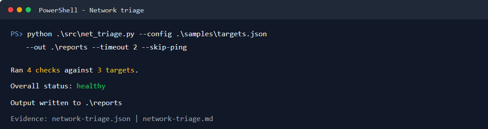
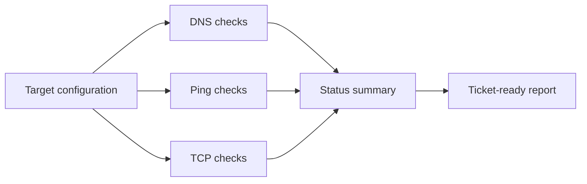

# Network Troubleshooting Toolkit

[](https://github.com/vxti-glitch/network-troubleshooting-toolkit/actions/workflows/python-tests.yml)


A help desk focused network triage CLI that runs repeatable DNS, ping, TCP port, and local network checks, then writes escalation-ready Markdown and JSON reports.

This project is built for entry-level IT interviews: it shows practical troubleshooting flow, clean report writing, testable code, and safe defaults.



_Sample run against the included target configuration._

## What it demonstrates

- DNS resolution checks
- TCP port reachability checks
- Ping availability checks
- Local adapter/IP configuration capture
- JSON-driven target configuration
- Markdown and JSON report exports
- Unit-tested diagnostic logic
- GitHub Actions CI

## Workflow



## Quick start

```powershell
python .\src\net_triage.py --config .\samples\targets.json --out .\reports --include-local-info
```

Use `--fail-on-down` when running this in automation and a fully down target set should fail the job.

Generated files:

- `reports/network-triage.json`
- `reports/network-triage.md`

See the checked-in [example triage report](docs/examples/network-triage.md) and [example JSON evidence](docs/examples/network-triage.json).

## Sample target config

```json
{
  "targets": [
    {
      "name": "Microsoft Login",
      "host": "login.microsoftonline.com",
      "dns": true,
      "ping": false,
      "ports": [443]
    }
  ]
}
```

## Help desk workflow

1. Confirm the user impact and affected service.
2. Run this tool against the gateway, DNS provider, and affected SaaS endpoint.
3. Attach the Markdown report to the ticket.
4. Escalate if DNS fails, TCP 443 fails for a SaaS endpoint, or local adapter data is abnormal.

## Notes

Some services block ICMP ping while still serving HTTPS correctly. For cloud services, TCP 443 is usually a better availability signal than ping.
