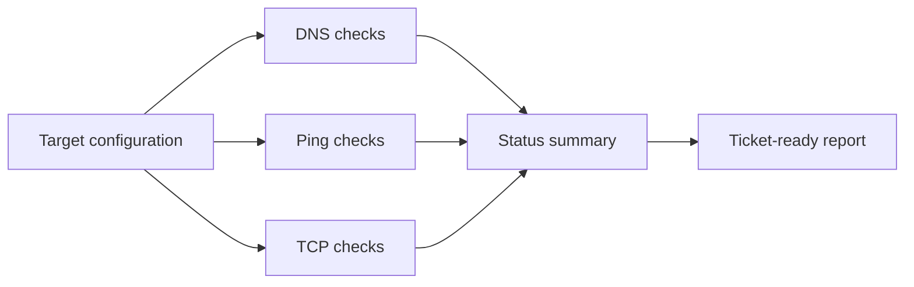

# Network Troubleshooting Toolkit

[](https://github.com/vxti-glitch/network-troubleshooting-toolkit/actions/workflows/python-tests.yml)


A help desk focused network triage CLI that records the system DNS path, ICMP evidence, TCP port reachability, and local network state, then writes escalation-ready Markdown and JSON reports without overstating what any single check proves.

I built this portfolio project to show a practical troubleshooting flow, clear report writing, testable code, and safe defaults.

## Interactive demo

[Launch the Network Triage Lab](https://vxti-glitch.github.io/network-troubleshooting-toolkit/)

The browser demo provides an installation-free way to review the troubleshooting workflow:

- Choose twelve realistic synthetic incidents covering healthy SaaS access, VPN/DNS and route failures, blocked ports, APIPA/DHCP, wrong gateway, loss/latency, Wi-Fi roaming, duplicate IP symptoms, adapter faults, and proxy/captive-portal behavior
- Follow the service path from the endpoint through gateway, DNS, and application port
- Review the technician assessment and recommended next action
- Review packet-loss/RTT evidence separately from command elapsed time, per-run timestamps, endpoint context, and alert acknowledgement state
- Generate a ticket-ready note plus downloadable Markdown, JSON, and adapter evidence
- Compare the browser logic with the tested Python implementation in this repository

> **Portfolio disclosure:** The browser scenarios are a simulation, not real network tests, paid employment, or production network scans. Browsers cannot perform the raw ICMP and TCP checks used by the Python CLI, so the demo uses transparent synthetic results to explain the decision process safely.


_Sample run against the included target configuration._

## What it demonstrates

- System DNS-path observations with explicit evidence limitations
- TCP port reachability checks
- Parsed ICMP packet-loss and RTT evidence; ICMP failure alone is not treated as application failure
- Local adapter/IP configuration capture with APIPA, gateway, DNS, DHCP, and route interpretation
- Twelve hypothesis-driven troubleshooting scenarios and an interactive field guide
- JSON-driven target configuration
- Markdown and JSON report exports
- Unit-tested diagnostic logic
- GitHub Actions CI

## Workflow



## Quick start

```powershell
python .\src\net_triage.py --config .\samples\targets.json --out .\reports --include-local-info
```

Use `--fail-on-down` when running this in automation and a fully down target set should fail the job.

Generated files:

- `reports/network-triage.json`
- `reports/network-triage.md`

See the checked-in [example triage report](docs/examples/network-triage.md) and [example JSON evidence](docs/examples/network-triage.json).

Read [How I built and verified this](docs/HOW_I_BUILT_AND_VERIFIED_THIS.md) for the parser and measurement boundaries. [`evidence/README.md`](evidence/README.md) defines the evidence required before claiming a controlled DNS-failure lab; no such result is currently committed.

To preview the interactive demo locally:

```powershell
python -m http.server 8000 --directory docs
```

Then open `http://127.0.0.1:8000`. The GitHub Pages workflow publishes the `docs` directory after Pages is configured to use GitHub Actions.

## Sample target config

```json
{
  "targets": [
    {
      "name": "Microsoft Login",
      "host": "login.microsoftonline.com",
      "dns": true,
      "ping": false,
      "ports": [443]
    }
  ]
}
```

## Help desk workflow

1. Confirm the user impact and affected service.
2. Run this tool against the gateway, DNS provider, and affected SaaS endpoint.
3. Attach the Markdown report to the ticket.
4. Escalate if DNS fails, TCP 443 fails for a SaaS endpoint, or local adapter data is abnormal.

## Notes

Some services block ICMP ping while still serving HTTPS correctly. For cloud services, TCP 443 is usually a better availability signal than ping.

Before sharing a report, remove or replace usernames, hostnames, internal domains, SSIDs/BSSIDs, public IP addresses, VPN identifiers, unrelated adapter details, and other identifying data. The checked-in examples use synthetic or documentation-safe values.
